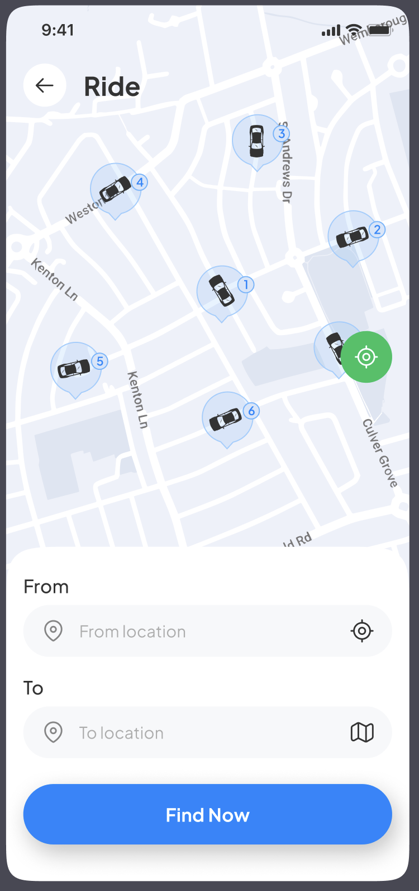
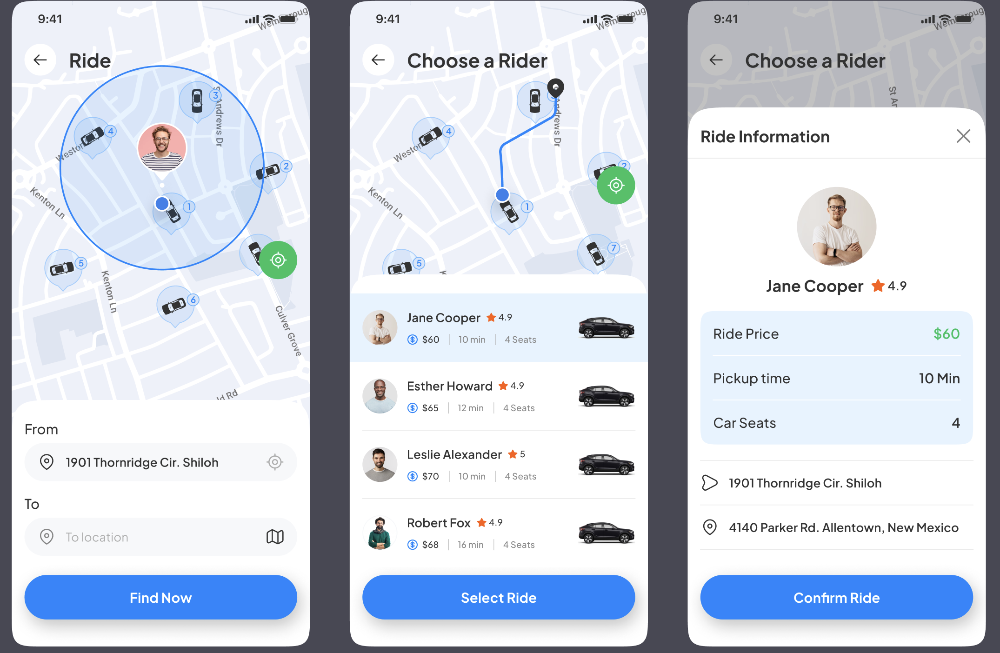
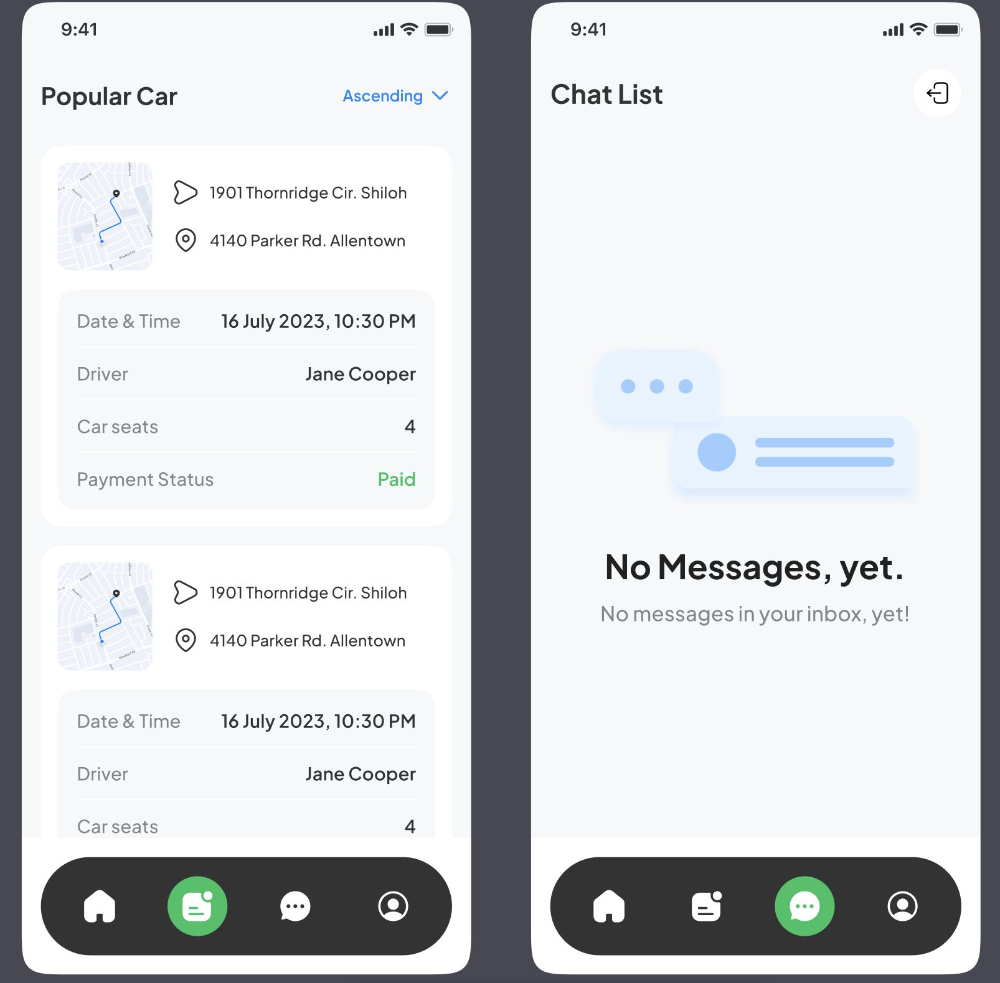

# About

Mobile app that helps you find nearby rides without breaking a sweat. Built with React Native, it’s got maps, login, payments, and all the stuff you'd expect.

### Example screens

    

      
      
    

      
      

##  Tech Stack

- **React Native** — Cross-platform mobile development  
- **Expo** — Streamlined development and deployment  
- **Stripe** — Secure and flexible payment processing  
- **PostgreSQL** — Reliable and scalable relational database  
- **Google Maps** — Real-time location and map services  
- **zustand** — Lightweight state management  
- **Clerk** — User authentication and session management  
- **Tailwind CSS** — Utility-first styling for React Native (via NativeWind)  

## Features

- **Onboarding Flow**  
  Smooth user registration and initial setup  

- **Email & Password Authentication with Verification**  
  Sign in securely and verify identity via email  

- **Google oAuth Integration**  
  One-tap sign-in using Google accounts  

- **Role-Based Authorization**  
  Access control tailored to user roles and permissions  

- **Live Home Screen with Google Map**  
  Displays user’s current location with real-time markers  

- **Recent Rides Overview**  
  Quick access to previous ride history  

- **Google Places Autocomplete**  
  Smart location search with global coverage  

- **Ride Finder**  
  Enter starting and destination points to find rides  

- **Map-Based Ride Selection**  
  Choose rides visually based on nearby car markers  

- **Ride Confirmation**  
  View detailed trip info, including fare and estimated time  

- **Stripe Payments**  
  Pay securely via card and other supported methods  

- **Ride Creation on Successful Payment**  
  Book a ride only after confirming payment completion  

- **User Profile Management**  
  Edit and update personal and account information  

- **Ride History Log**  
  Access a full history of all booked rides  

- **Cross-Platform Compatibility**  
  Fully responsive on both Android and iOS  

